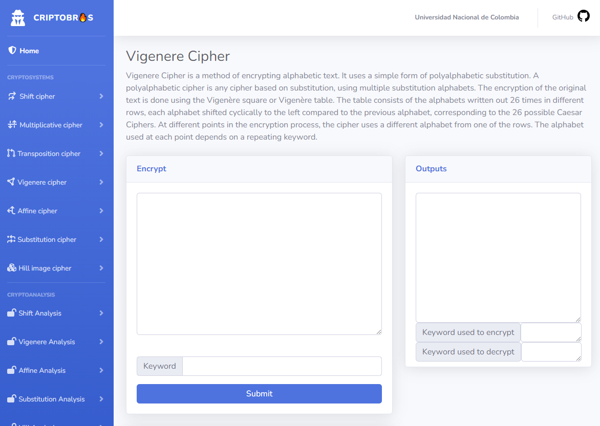
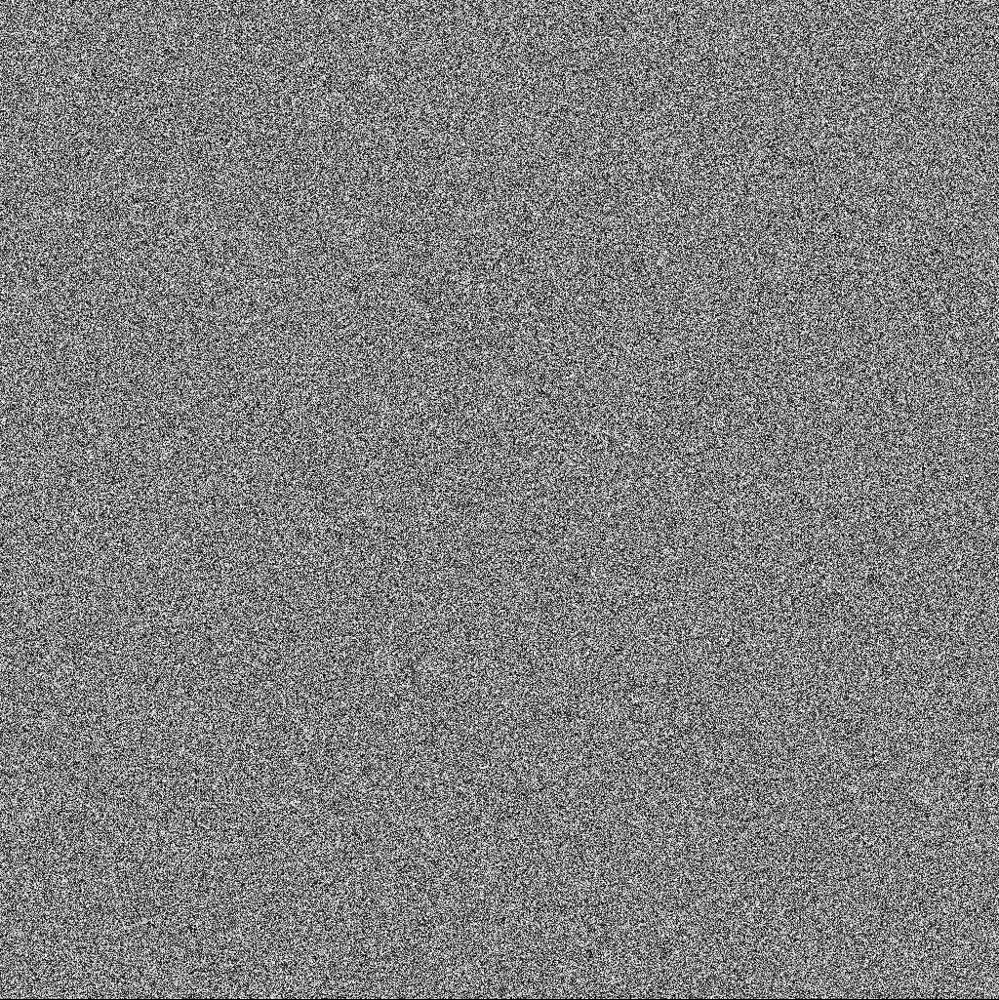
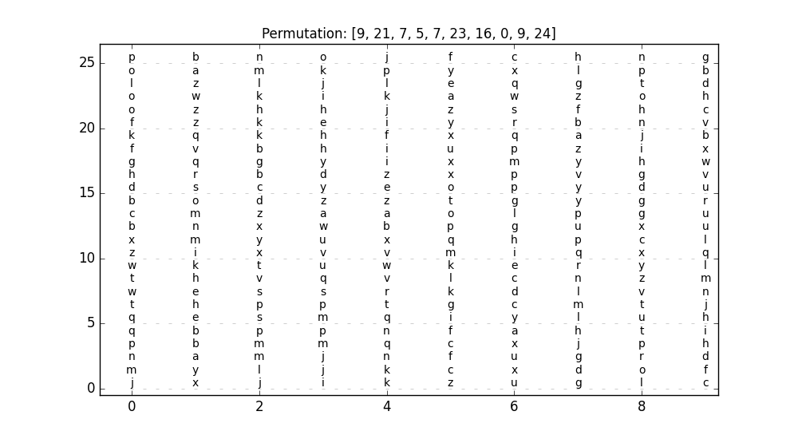
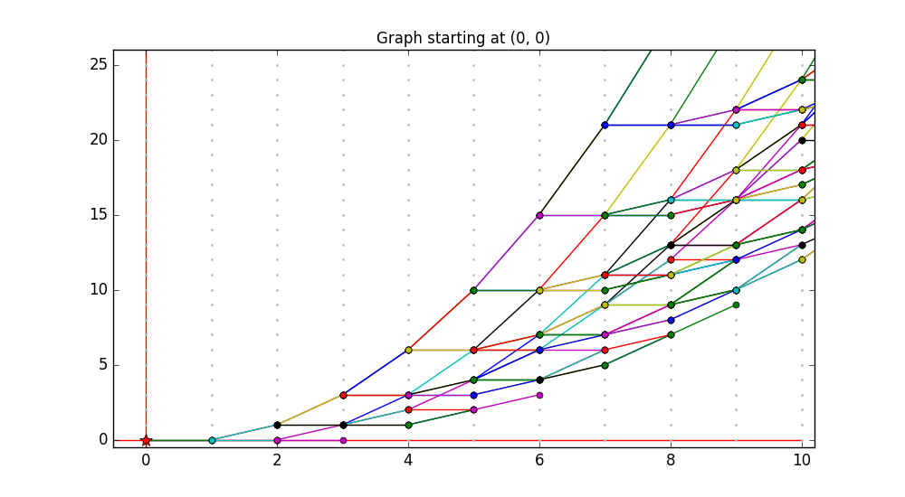

# CriptoBros, easy to use encrypting tool

Live demo [here](http://ec2-3-129-10-141.us-east-2.compute.amazonaws.com:8000/)

This is a web-based encryption proposal developed for "Introduction to Cryptography" (Universidad Nacional de Colombia). Below you will find a walkthrough and a brief explanation of the project. The front-end was built using `Bootstrap` and `Django`.

## What to expect

- **Easily encrypt and decrypt plain text**, the user can provide a key; otherwise the app will provide a random one.
- Perform **cryptoanalysis and attack** and retrieve information from encrypted texts.
- **Encrypt and decrypt images** using the Hill Image-Encryption method

<p align="center" width="100%">
  
</p>

## Implemented encryption methods

- [**Hill Image Encryption**](#hill-image-encryption)
- [**Shift cipher**](#shift-cipher)
- [**Multiplicative Cipher**](#multiplicative-cipher)
- **Transposition Cipher**
- [**Vigenere cipher**](#vigenere-cipher)
- [**Affine cipher**](#affine-cipher)
- **Substitution cipher**

## Hill Image Encryption
[(Back to top)](#what-to-expect)

The Hill cipher algorithm is a symmetric key algorithm which means that we can get the decryption key out of the encryption one easily. In this case, we use an Involutory Key Matrix, the reason bethind this is that the inverse of an involutory matrix is itself, making the decryption methods easier.

The result of applying Hill Image Encryption are the following:<br><br>

 |  |  |  
---|---|---|---
Original image | Encrypted image | Encryption key | Decrypted image

<br><br>

 |  |  |  
---|---|---|---
Original image | Encrypted image | Encryption key | Decrypted image

<br><br>

## Shift Cipher
[(Back to top)](#what-to-expect)

The Shift cipher (also known as Caesar cipher) works by using the modulo operator to encrypt and decrypt messages. The Shift Cipher has a key $k$, which is an integer in $\mathbb{Z}_{26}$. The encryption function is $$e_k(x) = (x+k)mod n$$ and the decryption function is $$d_k(c) = (c-k)mod n$$ were $x$ is a clear text, $c$ is an encrypted text and $n = 26$.

## Multiplicative Cipher
[(Back to top)](#what-to-expect)

The Multiplicative cipher works by multiplying each letter's value by $k \in \mathbb{Z}_{26}$. The condition for the $k$ is that it must be a relative prime to 26, i.e. [3,5,7,9,11,15,17,19,21,23,25]. The encryption function is $$e_k(x) = (x\cdot k)mod n$$ and the decryption function is $$d_k(c) = (c\cdot k^{-1})mod n$$ were $x$ is a clear text, $c$ is an encrypted text and $n = 26$.

## Vigenere cipher
[(Back to top)](#what-to-expect)

Vigenere Cipher uses polyalphabetic substitution scheme, this means it uses multiple substitutions over a single text. In the Shift Cipher, all the letters are shifted by the same amount $k$. However, Vigenere Cipher implement several Shift Ciphers, one after another. In this Cipher, the user chooses a word not longer than the clear text, and repeats it until it matches the length of the text. Then, the encryption function is applied: $$e_i(x) = (x_i+k_i)mod n$$ for every letter $i$ on the text.

To decript, the decryption function is applied: $$e_i(c) = (c_i-k_i)mod n$$ The attack on this system is done by analyzing the frecuency of each letter, and comparing it to the [table frecuency of letters in the english alphabet](https://www3.nd.edu/~busiforc/handouts/cryptography/letterfrequencies.html).

## Affine Cipher
[(Back to top)](#what-to-expect)

The Affine cipher works by using the following encryption function: $$e_k(x) = (a\cdot x+b)mod n$$ where:
- $a$ and $b$ must be relative primes to 26.
- $b$ is smaller than $a$.
The affine cipher is a reinforcement to the multiplicative cipher mentioned earlier.

The decryption function is defined as:  $$e_k(x) = a^{-1}\cdot(x-b)mod n$$

# V2.0

For version 2.0, bugs from the first release were fixed and the block cipher cryptosystems module was added, among which the following are shown below

## Gamma-Pentagonal Cipher
[(Back to top)](#what-to-expect)

The Gamma-Pentagonal cryptographic system has the property of probabilistic security since it is associated with a difficult problem of number theory.

More precisely, the problem we are dealing with consists in determining the number of ways in which an integer can be written as the sum of three polygonal numbers. It is recalled that polygonal numbers are those that can be described as a polygonal arrangement of points, for example, triangular numbers, squares, pentagonal, etc.

The difficult problem is to determine in how many ways a positive integer can be written as a sum of at least three square numbers. The above problem can be seen as finding how many admissible trajectories such as the ones we will illustrate later, connect the origin with a point in the usual plane. Then the point is related to a letter. The set-up process is as follows:
- The user must provide the `origin` coordinates, a `permutation` and the `clear text`. The origin and the permutation must remain secret.
- A matrix of 10 columns is created, each of which contains the complete alphabet (26 letters). Then the order of each column is shifted, the magnitude of the displacement is determined by the respective number in the initial permutation.
- At the same time, the following equivalence classes are created: $$\overline{x} := [ (a,b): a+b=x ] $$ Then, $d(\bar x)$ is defined as the sum of the incoming arrows for each point in the class.
- Finally, the value of each $a_{i,j}$ in the matrix is shifted by $d(\overline{(i,j)})$ units.

After this, the system is ready to encrypt, for each letter of the clear text, the letter's position $modulo$ $10$ is taken, then it starts searching bottom-up starting in the $position$ $(mod$ $10)$ column. If the letter was not present in the column, it moves on to the next column until it finds the letter. When the letter is found, the coordinate is added to the results list. This process is done for each of the letters of the clear text.

As an example, a resulting matrix using $[9, 21, 7, 5, 7, 23, 16, 0, 9, 24]$ permutation is shown as it follows

<p align="center" width="100%">
  
</p>

A graph generated with (0,0) as the origin point is shown bellow

<p align="center" width="100%">
  
</p>

To Decript, the user must provide the origin coordenates, the permutation and the ciphered coordenates. After doing the set-up, the coordinates are translated into letters, returning the original clear text. Since the keys in each alphabet can be used with the same probability when constructing ciphertexts then we can infer that the gamma-pentagonal system is unbreakable.

## Instalation and Dependencies
[(Back to top)](#what-to-expect)
As a general requirement, is is mandatory to have **`Python`** and **`Bootstrap 4`** installed.

After cloning this repository and entering the directory, follow this steps:

First, enter the `criptosite/` folder and execute

```pip install -r requirements.txt```

After that,  execute

```python main.py runserver```

Finally, open any web browser and traverse to

**`127.0.0.1:8000/`**

to view the app.

## Contact
[(Back to top)](#table-of-contents)

This repository was developed by [Juan Pablo Urrutia](https://github.com/jurrutiap), [Oscar Ordoñez](https://github.com/Odob13), [Raul Peña](https://github.com/rpenal) and [Paola Gallegos](https://github.com/PaolaGAPI). Any questions, please don't hesitate to reach out.
